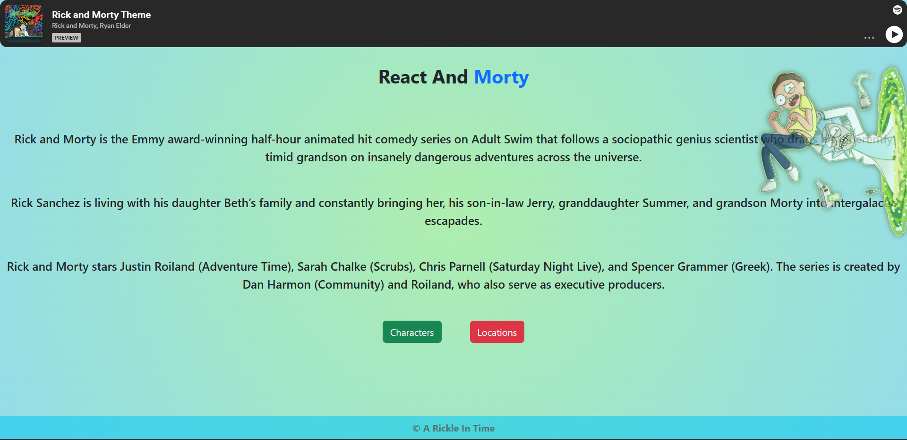
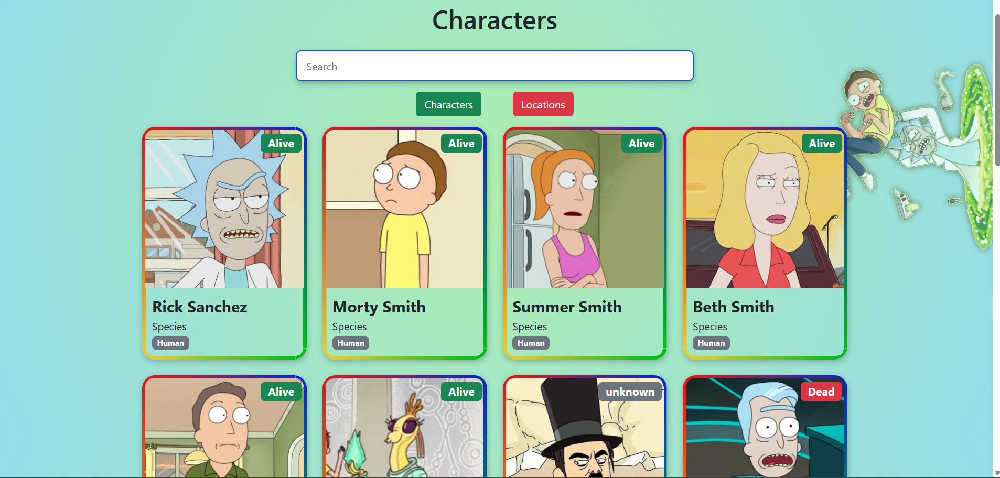
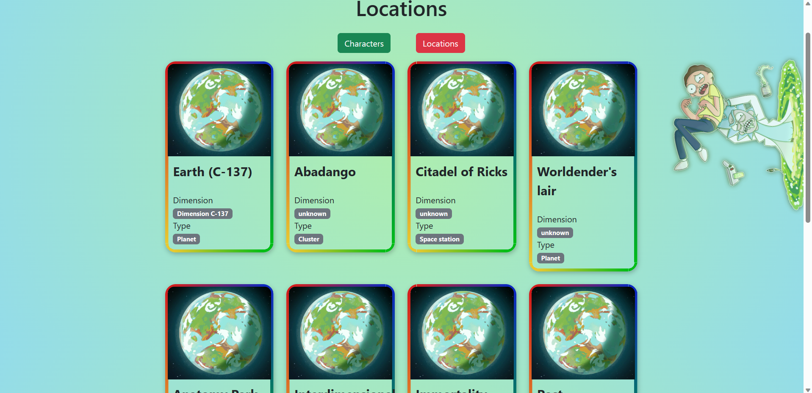

## React and Morty Project
This project is a web application built using React.js that allows users to explore information about
the popular animated TV show "Rick and Morty." It leverages the Rick and Morty API to fetch data
and display it in a user-friendly manner.

## Features
Character Information: Users can view a list of characters from the show along with their details such as name, species,
status, gender, and more.

Episode Guide: The application provides an episode guide where users can see a list of all episodes from different seasons.
Clicking on an episode will display additional information, including the air date, episode number, and a brief summary.

Search Functionality: Users can search for specific characters by name or filter them based on various criteria
such as species, status, and gender.

Responsive Design: The application is designed to be responsive and optimized for various screen sizes, ensuring a
seamless experience on both desktop and mobile devices.

## Screenshots

## Installation
To run this project locally, follow these steps:

Clone the repository:
"git clone https://github.com/silviumartinescu/react-and-morty"

Navigate to the project directory:
"cd react-and-morty"

Install the dependencies:
"npm install"

Start the development server:
"npm start"

Open your web browser and visit http://localhost:3000 to see the application running.

Technologies Used
React.js - A JavaScript library for building user interfaces.
React Router - A routing library for React applications.
Axios - A promise-based HTTP client for making API requests.
Rick and Morty API - An open API that provides data related to the show.
HTML5 and CSS3 - Markup and styling for the application.
Flexbox and Grid - CSS layout techniques for creating responsive designs.
Credits
Rick and Morty API - The API used to fetch data about the show's characters and episodes.
React Documentation - Official documentation for React.js.
React Router Documentation - Official documentation for React Router.
Contributing
Contributions are welcome! If you find any issues or have suggestions for improvement, please feel free to open an issue or submit a pull request.

License
This project is licensed under the MIT License. Feel free to use and modify the code as per your requirements.

Acknowledgements
Special thanks to the creators of the "Rick and Morty" TV show for their fantastic work and to the open-source community
for providing the tools and resources necessary to build this project.

Enjoy exploring the world of Rick and Morty!